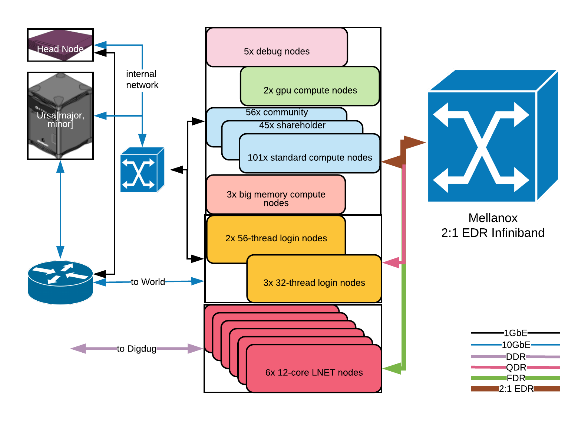

# System Architecture

### Physical Architecture

Chinook currently has five login nodes:

* chinook00.alaska.edu
* chinook01.alaska.edu
* chinook02.alaska.edu
* chinook03.alaska.edu
* chinook04.alaska.edu

chinook.alaska.edu will point to one of the above login nodes.

All Chinook compute nodes are Intel Relion 1900 compute nodes with either dual Intel Xeon E5-2685 v3 12-core processors \(24 cores per node\) or dual Intel Xeon E5-2690 v4 14-core processors \(28 cores per node\), and 128GB RAM.

### Software Architecture 

Chinook currently runs the CentOS 6.10 operating system \(Linux kernel version 2.6\).

Recent versions of the Intel and GNU compiler collections, several different MPI implementations, and core math libraries are available on Chinook. For more details, please refer to the list of [third-party software](../third-party-software/third-party-software.md) maintained on Chinook.

